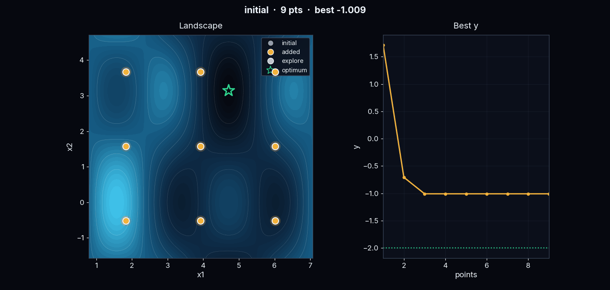

# BayesRobo

ガウス過程による能動学習・ベイズ最適化ツール。CSVから次の実験点を提案。
インストール不要。Web版・実行ファイル版の両対応。

## Web版

<https://ks278810.github.io/BayesRobo/>

ブラウザ内で完結（Pyodide / WebAssembly）。データ送信なし。
上記URLを開き、CSVをドラッグ&ドロップするだけ。

## 実行ファイル版（Windows / Linux）

インストール不要。ダウンロードしてそのまま使用。

1. [Releases](https://github.com/KS278810/BayesRobo/releases/latest) から
   OS別のファイルを取得
   - Windows: `bayesrobo-windows-x64.exe`
   - Linux: `bayesrobo-linux-x64`（初回のみ `chmod +x bayesrobo-linux-x64` が必要）
2. 実験データのCSV（列: 変数名を並べたあとに `y`）をドラッグ&ドロップ
3. 次に試すべき点をCSVへ自動追記。測定結果を `y` 列に記入し、再度ドラッグ&ドロップ

配布ビルドには使用期限あり（ビルド月の翌月末まで）。期限接近時は起動時に案内表示。

## 使用例

2変数の最適化問題での実行例。初期点9点（灰色）から開始し、追加提案点（金色）を
重ねながら大域最適解（緑の星）へ収束。

1. 初期データをCSVで用意（各変数の値と、対応する測定結果 `y`）
2. ドラッグ&ドロップで次の候補点を取得
3. 候補点を実際に測定し、`y` へ記入して再投入
4. 2〜3を繰り返し、最適解へ収束

## このリポジトリについて

ビルド済み配布物のみ。ソースコードは非公開の開発リポジトリ側。
公開用ビルド手順を通した成果物のみ配置（Pythonは `.pyc` のみのwheelに変換済み）。

- 自動生成のため直接編集不可（次回配置で上書き）
- 履歴なし。更新の都度、単一コミットを差し替え

## 問い合わせ

不具合の報告・ご要望は [Issues](https://github.com/KS278810/BayesRobo/issues) へ。
