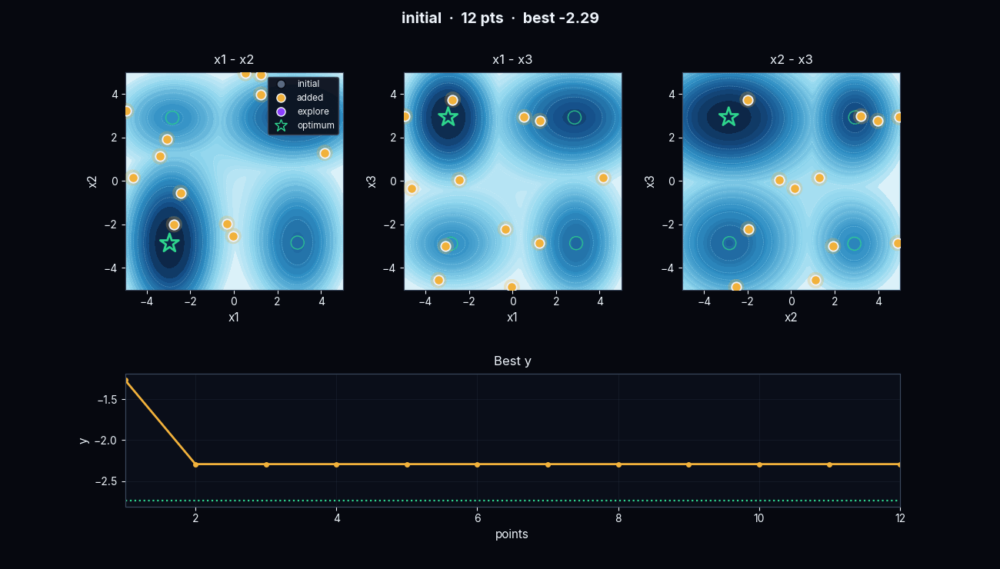

# BayesRobo

CSVから次の実験条件を1点提案。ガウス過程によるベイズ最適化。インストール不要。



## Web版（一番かんたん）

<https://ks278810.github.io/BayesRobo/> を開き、CSVをドラッグ&ドロップ。
ブラウザ内で完結、データ送信なし。

## 入手

[Releases](https://github.com/KS278810/BayesRobo/releases/latest) の「Assets」から、
次のファイルを取得して同じフォルダに置く。

- Windows: `bayesrobo-windows-x64.exe` と `sample.csv`（自動で回すデモを動かすなら `run_demo.bat` も。下の「自動で回す」）
- Linux: `bayesrobo-linux-x64`（初回のみ端末で `chmod +x bayesrobo-linux-x64` が必要）と `sample.csv`

`sample.csv` は下の自動デモ（`run_demo.bat`）と同じ例題（3変数・谷が4つある関数）です（[examples/](examples/) からも取得可）。

> Assets の下にある「Source code (zip / tar.gz)」と、緑の「Code」→「Download ZIP」は、
> GitHub が自動で付ける項目で、消せません。中身は README と例題（`sample.csv`・`run_demo.bat`）
> だけなので、通常は不要です。Web 版は上のURLを開くだけで使えます（ダウンロード不要）。

## CSVの作り方

`sample.csv` の中身:

```csv
id,x1,x2,x3,y
min,-5,-5,-5,
max,5,5,5,
1,1.251,3.972,2.757,-1.2626
2,-2.748,-1.998,3.736,-2.2934
3,-4.947,3.212,2.971,0.3443
4,-0.321,-1.97,-2.216,-0.1282
5,-2.451,-0.549,0.045,-0.5052
6,0.535,4.955,2.927,-0.2990
7,1.222,4.89,-2.847,0.2002
8,-3.398,1.125,-4.561,-0.1839
9,-4.643,0.149,-0.338,-0.0253
10,4.172,1.292,0.141,-0.2399
11,-0.031,-2.525,-4.882,0.0750
12,-3.076,1.92,-2.994,-1.0562
```

- 変数のあとに結果の列（一番右）
- `min`/`max` 行で範囲を指定（結果は空欄のまま）
- 未測定は空欄。**失敗した実験は空欄にせず最悪値を記入**（空欄は「まだ」の意味）

## まず1回だけ試す

`sample.csv` をexeへドラッグ&ドロップ。

1. 展開に**10〜30秒ほどかかる**。Windows版はロゴ画面が表示され、終わると文字だけの
   コンソール画面に切り替わる（Linux版は表示なし）。閉じずに待つ。
2. Windows に「Windows によって PC が保護されました」と出たら、
   **「詳細情報」→「実行」**（[詳しくは下](#windowsの警告について)）。
3. `BayesRobo: loading, please wait...` の文字が出れば動いている。数行の結果が出て、
   16行目に次の条件が1行追記される（`y` は空欄）。

その条件で実験し、`y` に結果を記入して保存。もう一度ドロップすると、
また次の条件が1行追記される。この繰り返し。

コマンドでも同じことができる: `.\bayesrobo-windows-x64.exe append sample.csv`
（Linux: `./bayesrobo-linux-x64 append sample.csv`）

## 自動で回す（Windows: run_demo.bat をダブルクリック）

「毎回手で記入」を、簡単な数式に置き換えて自動化するデモ。次の 3 つを**同じフォルダ**に置く。

- `bayesrobo-windows-x64.exe`
- `sample.csv`
- `run_demo.bat`

`run_demo.bat` を**ダブルクリック**すると、exe に次の条件を 3 点ずつ提案させ、例題の式で `y` を計算して書き戻す、を 10 回（合計 30 点）繰り返す。黒い画面に進み具合が
出て、最後に最良の条件が表示される（キーを押すと閉じる）。元の `sample.csv` は書き換えず、
結果は `demo_result.csv` に入る。

- exe は提案のたびに起動し直すため、**全体で数分かかる**（1 回あたり数秒〜30秒）。閉じずに待つ。
- Python は要らない（Windows に最初から入っている PowerShell を bat が呼ぶ）。
- **自分の実験に応用するには**: `run_demo.bat` をメモ帳で開く。`Evaluate` という関数が「実験」の
  部分（例題の式）なので、これを自分の実験・計算に置き換える。提案 → 評価 → 書き戻しのループも
  そのまま読める。回数と 1 回の点数は先頭の `$Rounds`・`$Batch`。
- 最大化したいときは、bat 内の `append` の行に `--goal max` を足す。
- ブラウザで落とした bat は、初回に警告（「実行しますか？」など）が出ることがある。
  内容は上のとおり PowerShell を呼ぶだけで、メモ帳で読める。

Linux: `./bayesrobo-linux-x64 append …` を繰り返すシェルスクリプトで同様に回せる。

## Windowsの警告について

「Windows によって PC が保護されました」は、exe に**デジタル署名がない**ために出ます
（署名には有料の証明書が要り、署名しても初回の警告は消えません）。ウイルスが
見つかったという意味ではありません。

- 出たら: **「詳細情報」→「実行」**（「実行」ボタンは「詳細情報」を押すまで表示されません）
- 毎回出るのが煩わしい場合: exe を右クリック →「プロパティ」→ 下の「許可する」にチェック →
  OK（または PowerShell で `Unblock-File .\bayesrobo-windows-x64.exe`）
- 警告を出さずに入手する（任意）: ブラウザで落とすと「ダウンロード元の記録」が付き、これが
  警告の元になる。PowerShell で直接取得すると付かない:

```powershell
Invoke-WebRequest https://github.com/KS278810/BayesRobo/releases/latest/download/bayesrobo-windows-x64.exe -OutFile bayesrobo-windows-x64.exe
Invoke-WebRequest https://github.com/KS278810/BayesRobo/releases/latest/download/sample.csv -OutFile sample.csv
```

- Windows 11 の「スマート アプリ コントロール」がオンの環境では、署名のない exe は警告ではなく
  起動がブロックされることがあります。その場合は Web 版を使ってください。

## 詰まったら

- 既定は最小化。大きいほど良い場合は `--goal max`（コマンド版・PowerShell版のみ）
- 一度に複数の候補が欲しいときは `--batch 3` のように追加
- 結果を埋めずに再ドロップは不可
- 配布ビルドには使用期限あり（ビルド月の翌月末）。毎月1日に新しいビルドが
  [Releases](https://github.com/KS278810/BayesRobo/releases/latest) に自動で出るので、
  期限切れの表示が出たら取り直してください
- 全オプションは `bayesrobo -h`

## このリポジトリについて

ビルド済み配布物のみ。ソースは非公開の開発リポジトリ側。自動生成のため直接編集不可、履歴なし。

## 問い合わせ

[Issues](https://github.com/KS278810/BayesRobo/issues) へ。
